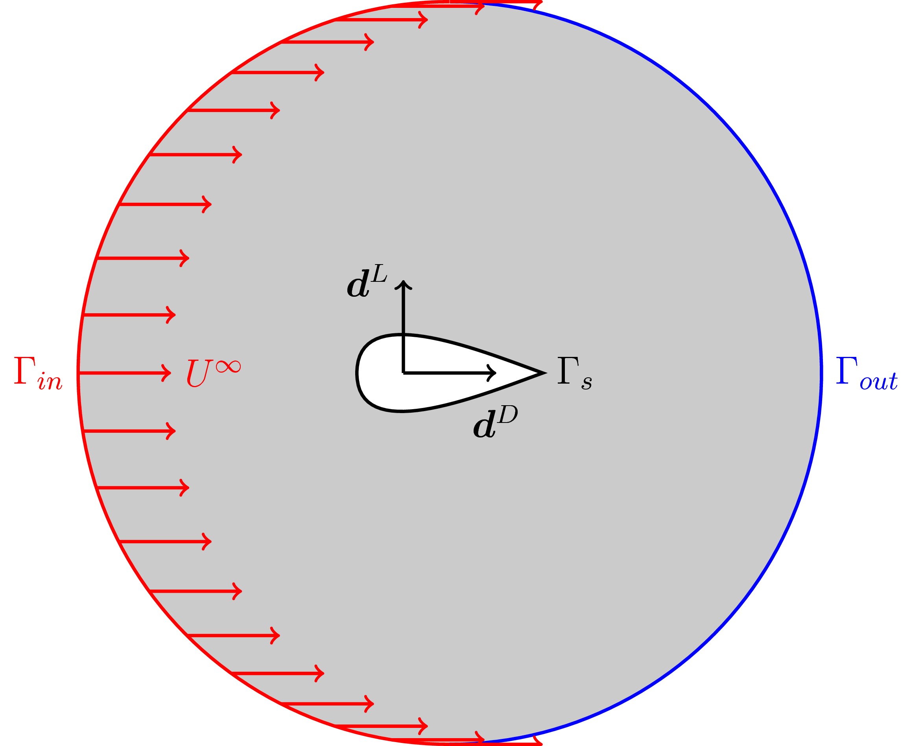

# Optimal Shape Design in External Flow

A natural application in the framework of shape optimization is the aerodynamic design of an airfoil. An object defined by a domain  with boundary  immersed in a fluid will experience a net force given by

  

where  is the stress tensor,  is the fluid pressure,  is the kinematic viscosity,  is the strain rate tensor, and  is the fluid velocity vector field. 

  

The force exerted by the fluid on the airfoil parallel to the fluid velocity at infinity is referred to as the drag force, whereas the force in perpendicular direction is often named the lift.

    

    

We look for the optimal shape in order to minimize the drag, as this force produces energy losses, and at the same time maximize the lift for a fixed airfoil volume. This can be expressed by means of the functional

    

    

where  and  are weighting factors for drag and lift forces, respectively, and with . The state variables are subject to a set of constraints in the fluid domain  with boundary , namely the steady Navier-Stokes equations,

    

and to the volume constraint

    

The adjoint problem reads as

    

The directional derivative of the functional is given by 

    

and the cost function descreases by choosing the normal displacement to the controlled boundary as

    

